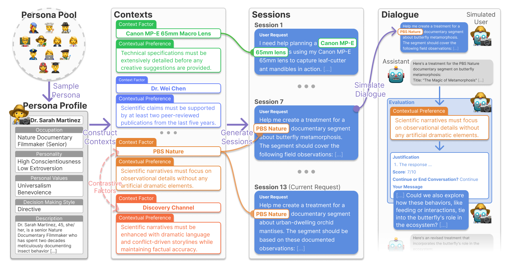

# 🏹 CUPID: Evaluating Personalized and Contextualized Alignment of LLMs from Interactions

  <p align="center">  <a href="https://cupid.kixlab.org/"></a>
  <a href="https://arxiv.org/abs/2508.01674"></a>
  <a href="https://huggingface.co/datasets/kixlab/CUPID"></a>
  <a href="https://huggingface.co/datasets/kixlab/CUPID-Raw"></a>
  <a href="https://huggingface.co/datasets/kixlab/CUPID-Unverified"></a>
  <a href="https://huggingface.co/kixlab/prefmatcher-7b"></a>
</p>

<p align="center">
  
</p>

<p align="center">
<a href="https://taesookim.com/">Tae Soo Kim</a>, <a href="https://yoonjoolee.com/">Yoonjoo Lee</a>, <a href="https://www.linkedin.com/in/yoonah-park-50ba57249/">Yoonah Park</a>, <a href="https://jihokim.dev/">Jiho Kim</a>, <a href="https://younghokim.net/">Young-Ho Kim</a>, <a href="https://juhokim.com">Juho Kim</a>
</p>

We introduce **CUPID** 🏹, a benchmark for evaluating the capability of Large Language Models (LLMs) to infer and apply personalized, contextual preferences from multi-turn user interactions. Unlike existing approaches that assume static global preferences, CUPID tests models' ability to understand dynamic, context-dependent user preferences revealed through conversational and implicit feedback.

## 🎯 Overview

CUPID contains **756 human-curated interaction session histories** between simulated users and LLM-based AI assistants. Each interaction session involves a specific context factor (e.g., person, artifact, organization) and presents a user expressing their preference relevant to the context through multi-turn feedback.

**Key Features:**
- **Contextual Preferences**: Tests models' ability to infer preferences that change based on context
- **Multi-turn Interactions**: Evaluates understanding from conversational feedback rather than explicit statements  
- **Preference Inference**: Assesses capability to extract relevant preferences from prior interactions
- **Response Generation**: Tests application of inferred preferences to new requests
- **Comprehensive Evaluation**: Presents metrics to asses model performance at preference inference and response genration

**Evaluation Tasks:**
1. **Preference Inference**: Given prior interactions, infer the user's contextual preference
2. **Response Generation**: Given prior interactions, generate response that can satisfy the user's contextual preferences

## 🛠️ Setup

### Environment

We recommend using a conda environment:

```bash
conda create -n cupid python=3.9
conda activate cupid
pip install -r requirements.txt
```

### API Keys

Set up your API keys for model evaluation:

```bash
export OPENAI_API_KEY="your_openai_key"
export ANTHROPIC_API_KEY="your_anthropic_key" 
export TOGETHER_API_KEY="your_together_key" # For models supported by Together AI
export GOOGLE_API_KEY="your_google_key"  # For Gemini models
```

## 📊 Dataset

The CUPID dataset is available on HuggingFace: [kixlab/CUPID](https://huggingface.co/datasets/kixlab/CUPID)

**Dataset Structure:**
- **756 instances** across diverse personas and contexts
- **Human-curated interactions** showing contextual preference expression
- **Three instance types**: consistent, contrastive, and changing preferences
- **Rich context factors** influencing user preferences (e.g., personal relationships, prior experiences, etc.)

**Data Fields:**
- `persona_id`: Unique identifier for the user persona
- `current_request`: The request to be answered by the model
- `current_context_factor`: Context influencing the user's preference
- `current_contextual_preference`: Ground-truth preference for this context
- `current_checklist`: Specific criteria for evaluating response alignment
- `prior_interactions`: List of previous interaction sessions showing user feedback

Check [kixlab/CUPID-Raw](https://huggingface.co/datasets/kixlab/CUPID-Raw) for the full personas, context factors, and interaction sessions used to synthesize the benchmark.

We also release [kixlab/CUPID-Unverified](https://huggingface.co/datasets/kixlab/CUPID-Unverified), a non-validated version of CUPID with >3k instances.

## 🚀 Evaluation

### Quick Start

Evaluate a model on the CUPID dataset:

```bash
python -m evaluation.run \
    --results_dir results \
    --model "gpt-4.1-nano-2025-04-14" \
    --evaluator gpt-4o-2024-11-20 \
    --n_workers 4
```

**Key Parameters:**
- `--model`: Model to evaluate (must have a corresponding class in `evaluation/models/`)
- `--evaluator`: Model used for evaluation functions (preference decomposing and matching, response judging)
- `--use_matcher`: Use our finetuned preference matcher ([kixlab/prefmatcher-7b](https://huggingface.co/kixlab/prefmatcher-7b)) for preference inference
- `--task`: Run `inference`, `generation`, or `both` evaluation stages
- `--data_dir`: Use custom data instead of the official CUPID dataset (data synthesis explained in the next section)

### Adding New Models to Evaluate

To evaluate your own model, you must first create a new model class in `evaluation/models/your_model.py` that inherits the `Model` class and implements the model's inference logic. The `__call__` method should take in a system prompt and a user prompt, and return only the final text response.

1. Create a new model class in `evaluation/models/your_model.py`:

```python
from evaluation.models.model import Model, register_model

@register_model
class YourModel(Model):
    model_name = "your-model-name"
    
    def __call__(self, system_prompt, user_prompt):
        # Your model inference logic here
        return response
```

2. Run evaluation:

```bash
python -m evaluation.run --model your-model-name --results_dir results
```

### Evaluation Metrics

CUPID evaluates models on two main tasks:

**1. Preference Inference (Precision/Recall/F1)**
- Measures how well models can infer the user's preference for the current request from prior interactions
- Compares inferred preference to the ground-truth preference
- Optionally, you can use our finetuned preference matcher for more cost-efficient evaluation
    - Our finetuned preference matcher is available on HuggingFace: [kixlab/prefmatcher-7b](https://huggingface.co/kixlab/prefmatcher-7b)
    - First, run the bash script `evaluation/serve_prefmatcher.sh` to serve the model through VLLM
    - This will serve the model at `http://localhost:8000`
    - Then, run the evaluation script with the `--use_matcher` flag

**2. Response Generation (Average Score 1-10)**  
- Evaluates how well generated responses satisfy user preferences
- Scored by LLM-based judges on response-preference alignment

## 🔧 Synthesis Framework

This respository also incldues the synthesis pipeline for CUPID to generate additional training/evaluation data.

### Generate Synthetic Data

```bash
python -m synthesis.run \
    --output_dir synthetic_data \
    --model "anthropic.claude-3-5-sonnet-20241022-v2:0" \
    --n_personas 10 \
    --n_factors 8 \
    --n_sessions 13 \
    --max_turns 16 \
    --n_workers 4
```

**Key Parameters:**
- `--output_dir`: Directory to save the generated data
- `--model`: Model to use for data generation
- `--n_personas`: Number of personas to generate (default: 4)
- `--n_factors`: Number of context factors to generate (default: 8)
- `--n_sessions`: Number of interaction sessions to generate (default: 13)
- `--max_turns`: Maximum number of turns in an interaction session (default: 16)
- `--n_workers`: Number of workers to use for data generation (default: 1)

**Synthesis Pipeline:** Consists of four main steps:
1. **Persona Generation**: Create diverse user personas with different backgrounds and taits
2. **Context Factors**: For each persona, generate context factors that influence preferences  
3. **Session Generation**: Create interaction scenarios based on personas and contexts
4. **Interaction Simulation**: Simulate multi-turn conversations with preference feedback

## 📁 Project Structure

```
cupid/
├── evaluation          # Evaluation framework
│   ├── models/         # Model implementations
│   ├── modules/        # Evaluation components
│   ├── pipeline/       # Evaluation pipeline
│   └── run.py          # Main evaluation script
├── synthesis/          # Data synthesis framework  
│   ├── modules/        # Synthesis components
│   ├── pipeline/       # Synthesis pipeline
│   └── run.py          # Main synthesis script
├── prompts/            # Prompt templates
│   ├── evaluation/     # Evaluation prompts
│   └── synthesis/      # Synthesis prompts
├── utils/              # Utility functions
├── config.py           # Configuration settings
└── requirements.txt    # Dependencies
```

## 📄 Citation

If you find our work useful, please consider citing our paper!

```bibtex
@article{kim2025cupid,
  title     = {CUPID: Evaluating Personalized and Contextualized Alignment of LLMs from Interactions},
  author    = {Kim, Tae Soo and Lee, Yoonjoo and Park, Yoonah and Kim, Jiho and Kim, Young-Ho and Kim, Juho},
  journal   = {arXiv preprint arXiv:2508.01674},
  year      = {2025},
}
```
